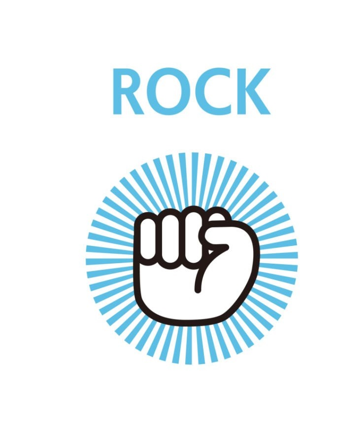
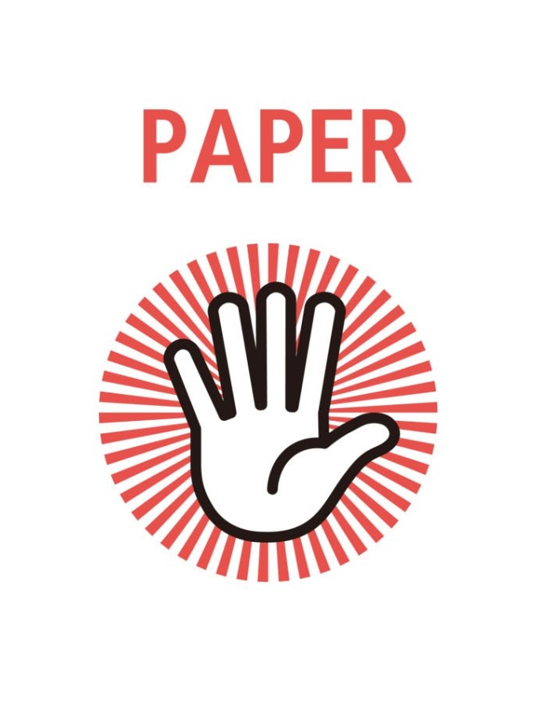
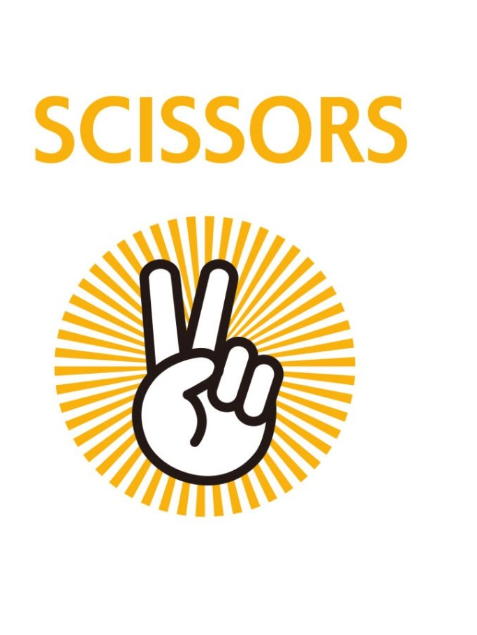

# [猜拳遊戲](https://yuwei0531.pythonanywhere.com/)

## 使用工具
1. [ChatGPT](https://developers.line.biz/zh-hant/)
2. [Pythonanywhere](https://www.pythonanywhere.com/)
3. [GitHub](https://github.com/) (可選)

## 操作步驟
先登入 ChatGPT 接著輸入以下關鍵字
1. 請問我想使用flask 做出一個網頁可以做猜拳的小遊戲
網頁呈現三個 按鈕 剪刀、石頭、布 讓使用者點擊
後台也會亂數選出一個 來判斷使用者是輸還是贏
請問我該如何撰寫 謝謝

2. 能夠使用 Ajax 技術 讓使用者的頁面不跳轉嗎？

3. 有辦法加上 sweetalert2 跳出彈出視窗 顯示是誰贏誰輸嗎？

4. 請問可以順便引入 bootstrap v5.3 來把三個按鈕 均分顯示在畫面上嗎 我會找3張 猜拳的圖片 放進去

5. 我贏了 電腦贏了 平局 三種的sweetalert 可以顯示不同icon嗎？

6. 顯示三種情形時 能加上 電腦選的拳種嗎？ 這樣比較明顯能分辨出我贏或輸

## 圖片

## 參考附件
1. [Pythonanywhere Flask 部屬](https://www.youtube.com/watch?v=-1KqfigrL4E&ab_channel=%E8%98%87%E9%9F%8B%E6%96%87)